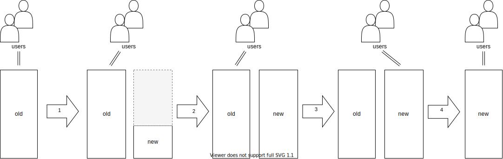

**Warning:** This is unfinished work in progress. I hope it can nonetheless be of use.
{: .notice--danger}

“All happy families are alike; each unhappy family is unhappy in its own way.” This *Anna Karenina principle* applies not only to families but also to software systems. Different software systems suffer from different diseases and we need different cures for these. Many legacy systems suffer from:

- model anemia,
- being a big ball of mud, or
- bad team organization.

Most of them suffer from a combination of these diseases. Domain-Driven Design can help transform such systems into a healthier state.

In [@Fowler2019] many standard refactorings are described; [@Kerievsky20XX] shows how to refactor the patterns from [@Gamma1995].
On this page, I’m collecting refactorings that help to introduce patterns originally described in [@Evans2004], [@Fowler2004], and others.
The catalog is split into three categories:

- **Tactical Refactorings:** Change the inner implementation of a bounded context
- **Strategic Refactorings:** Help with splitting a monolith architecture into bounded contexts.
- **Socio-technical Refactorings:** Reorganize the teams. This is often enabled by and/or accompanying strategic refactorings.

<!--
I use Java as language for most of the examples. The reason for that is that it’s the language in which the most monoliths have been build (although other languages are equally well suited to build them...).
-->

In the descriptions I follow the classic Fowlerian format of Introduction/Motivation/Mechanics/Example(s).

## Big Bang Approach vs. Strangler Fig Application Approach

When dealing with a legacy system, generally two strategies exist:

1. Build a new system from scratch and “when it is done” replace the old system with it
2. Iteratively transform the old system into a modern state so that it becomes the new system

The idea of strategy no. 1 is that the new system will be build on a greenfield in a clean and save space. Eventually we “just flip the switch” and—snip—a new world is there. Since this reminds of the creation of the universe by the Big Bang this is called a *big bang replacement*. The steps of this approach are depicted in the following picture:

<!--

-->


While it might sound reasonable in theory, practice shows that this approach is problematic. That’s why strategy no. 2 is often preferred. Step-by-step functionality is build or transformed into the new system. As early as possible the users use both the systems. Such a pattern is called a *strangler fig application* and the evolvement is shown in the following picture:

<!--

-->


The functionality in the new system can be the result of either caring out existing functionality from the old system, building it from scratch or replacing it with standard software.

## The Catalog

| Strategic Refactorings |
|--------|
| [Carve Out Bounded Context (out of Monolith)](strategic/carve-bounded-context-out-of-monolith) |
| [Implement Bounded Context from Scratch (and Replace it in the Monolith)](implement-bounded-context-from-scratch) |
| Carve Out Data Model First |
| Carve Out Domain Model First |
| EXPLORE: [Extract Shared Kernel](strategic/extract-shared-kernel.md) |

| Socio-technical Refactorings (and Patterns) |
|--------|
| [Form Cross-Functional Team out of Layer-Team Members](socio-technical/form-cross-functional-team-out-of-layer-team-members) |
| [Form Second Team out of Partly Layer-Team and First-Team Members](socio-technical/form-second-team-out-of-partly-layer-team-and-first-team-members) |
| [Form Second Team out of Only Layer-Team Members](socio-technical/form-second-team-out-of-partly-layer-team-and-first-team-members) |
| [Move Operations Team Member to DevOps Team](socio-technical/move-operations-team-member-to-devops-team) |
| Assign Bounded Context to Existing (Cross-Functional) Team |
| EXPLORE: Give Core Domains to Best Team |
| EXPLORE: Give Every Team one Core Domain (and additional supporting) |

| Tactical Refactorings (Against Model Anemia) |
|--------|
| [Enforce Ubiquitous Language](tactical/enforce-ubiquitous-language) |
| [Replace Primitive with Value Object](tactical/replace-primitive-with-value-object) |
| [Split Active Record into Aggregate and Repository](tactical/split-active-record-into-aggregate-and-repository) |
| [Split Repository into Interface and Implementation](tactical/split-repository-into-interface-and-implementation) |
| Combine Value Objects |
| Replace Collection of Entities with Entity in Its Own Right (=> there is a relationship to *Encapsulate Collection*) |
| Replace Collection of Entities with Repository |
| Heal Entity Anemia |
|  - Remove Setter |
|  - Replace Setter with Domain-Named Method |
|  - Move Domain Logic from Service Down to Entity (=> *Move Statements into Function*, *Move Statements to Caller*) |
| Introduce Contract (=> relationship to *Introduce Assertion*) |

| Tactical Refactorings to Support Strategic Refactorings (Against BBOM)|
|--------|
| [Carve Specialized Entity Out of Monolithic Entity](tactical-for-strategic/carve-specialized-entity-out-of-monolithic-entity) |
| [Replace Method Call with Domain Event](tactical-for-strategic/replace-method-call-with-domain-event) |

## Acknowledgement

{: width="250" .align-right}

I thank the participants of the open space “Domain-Driven Refactorings” at [KanDDDinsky](https://kandddinsky.de/) 2021 conference. As you can see on the right, many of the above described refactorings have been collected there.

<!--
## Bibliography
-->
