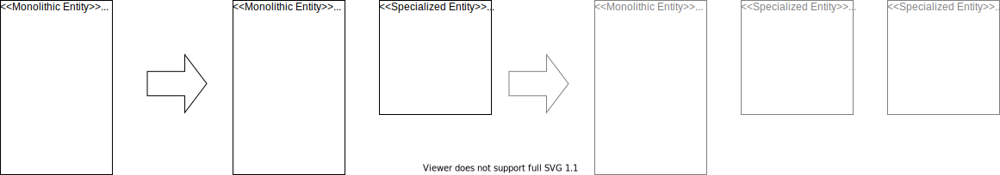

*A special case of [Extract Class](https://refactoring.com/catalog/extractClass.html)*

## Motivation

%% TODO: or:  "When to Apply"

## Mechanics

- Create empty new class in carved-out context
- Add instance field of type new class to the old class
- Copy to-be-moved fields from old to new class => [Move Field](https://refactoring.com/catalog/moveField.html)
- Copy first to-be-moved method to new class
- Replace method body in old class with a forward to method in new class
- Step by step replace calls to the method in the old class with calls to the method in the new class
- Delete the implementation in the old class
- Delete now unused fields in old class
- Repeat with other to-be-moved methods
- Remove instance field of type new class in the old class

## Example(s)
