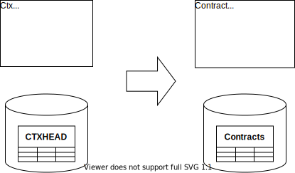

{: .align-center}

## Motivation

Whenever the code uses bad names, obscure technical names, strange abbreviations, or names that do not reflect your current understanding of the domain—change them accordingly. DDD calls this philosophy “Refactoring Towards Deeper Insight.”

## Mechanics

<!--
TODO: Rename Class is not in Fowler's Catalog??
-->

<!--
TODO 2: Link to Remove Dead Code
-->

- When the code uses the wrong words apply Rename Class, [Rename Method](https://refactoring.com/catalog/changeFunctionDeclaration.html), [Rename Field](https://refactoring.com/catalog/renameField.html), [Rename Variable](https://refactoring.com/catalog/renameVariable.html) and the like to the source code.
- For the data model use [Rename Table](https://databaserefactoring.com/RenameTable.html), [Rename Column](https://databaserefactoring.com/RenameColumn.html), and [Rename View](https://databaserefactoring.com/RenameView.html).
- Change the user interface accordingly.

## Example(s)
