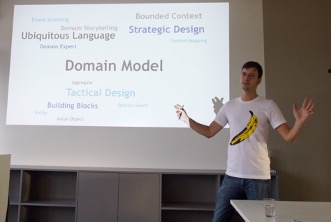

Hi, my name's Henning and I help to solve your software development problems.

## Consulting

You want to understand Domain-Driven Design?
Or you have a monolith/big ball of mud/legacy software you want to split?
Or you're building software from scratch and don't know how?

Give me a call or write an [e-mail](mailto:hs@wps.de)!

## Training/Speaking

I regularly give talks and workshops on international conferences.
You can also hire me for in-house trainings at your company.
This ranges from a one hour inspirational talk to a [three day training course](https://www.wps.de/ddd) including many practical exercises.

Topics include Domain-Driven Design, microservices, monolith splitting, Collaborative Modeling, and software architecture and development in general.
Please see my [list of talks](https://sessionize.com/hschwentner/).

## Writing

 [Stefan Hofer](https://www.wps.de/sh) and I have written a book. It's called *Domain Storytelling* and shows how to understand your users by drawing pictures. If you buy it at [InformIT]() or [Amazon.com](https://amzn.to/3nF34nI) or [Amazon.de](https://amzn.to/2ZrcpWc) using these links, I'll get a small cut.

 Together with [Carola Lilienthal](https://www.wps.de/cl) I've translated [Vaughn Vernon](https://vaughnvernon.com)'s *Domain-Driven Design Distilled* into German.

Also, I occasionally write magazine or blog [articles](/articles).

## Coding and Community

To showcase what I think is beautiful software architecture (and when to use a not-so-beautiful style), whenever I find the time I hack on the [LeasingNinja](https://leasingninja.io).

With a couple of devs from the community, I'm working on [xMolecules](https://xmolecules.org), a library to express architectural concepts and patterns as living documentation in code.

I'm one of the co-organizers of the [CoMoCamp](https://comocamp.org).

## Bio

When people ask me for a short CV, the following is what I write. And here is a high-resolution [profile picture](images/HenningSchwentner251.jpg).

“Henning loves programming in high quality. He lives this passion as coder, coach, and consultant at WPS – Workplace Solutions. There he helps teams to structure their monoliths or to build new systems from the beginning with a sustainable architecture. Microservices or self-contained systems are often the result. Henning is author of *Domain Storytelling* (published by Addison-Wesley), and the LeasingNinja.io as well as translator of *Domain-Driven Design kompakt* (published by dpunkt).”

## WPS

I'm lucky to work at one of the best companies in the world, [WPS – Workplace Solutions](https://wps.de).
It's a team of people that love programming, care about their co-workers and high quality, and are fun to work with.
I'm still amazed they let me play along.
Please see [my page at WPS](https://www.wps.de/hs).

We're always [looking for great new colleagues](https://www.wps.de/jobs).

## Contact and Social Media

[Mail](mailto:hs@wps.de)
[Twitter](https://twitter.com/hschwentner)
[GitHub](https://github.com/hschwentner)
[LinkedIn](https://www.linkedin.com/in/henningschwentner)
[Xing](https://www.xing.com/profile/JHenning_Schwentner)
[Imprint](https://www.wps.de/impressum/)
