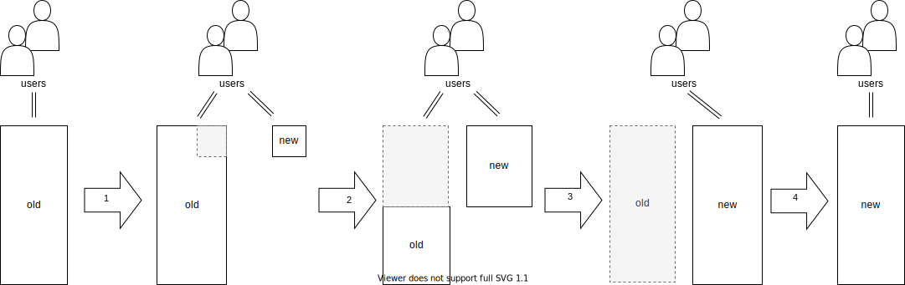

**Warning:** This is unfinished work in progress. I hope it can nonetheless be of use.
{: .notice--danger}

{: width="250" .align-right}

“All happy families are alike; each unhappy family is unhappy in its own way.” This *Anna Karenina principle* applies not only to families but also to software systems. Different software systems suffer from different diseases and we need different cures for these. Many legacy systems suffer from one or more of the following diseases:

- The legacy system has become a **big ball of mud** because no one controlled the dependencies and now everything is connected to everything else.
- The domain knowledge is entangled into one **huge domain model** whose parts fit together only partially or even contradict each other.
- **Business source code and technical source code** are mixed, and thus the replacement of obsolete technology or a domain extension becomes a Herculean task.
- People are organized in a **team structure** that is unsuitable for making fast progress.

[Carola Lilienthal](https://www.wps.de/cl) and I have collected the treatments for these diseases and written them down in our book [*Domain-Driven Transformation*](#bib:LilienthalSchwentner2024). <!--We use a combination of **Domain-Driven Design (DDD)**, **Refactorings**, **Domain Storytelling**, **EventStorming**, **Team Topologies** and the **Modularity Maturity Index (MMI)**.--> To perform the transformation, one needs *domain-driven refactorings*, which are collected here on this website. The catalog is split into four categories:

- **Strategic Refactorings:** Help with splitting a monolith architecture into bounded contexts.
- **Socio-technical Refactorings:** Reorganize the teams. This is often enabled by and/or accompanying strategic refactorings.
- **Tactical Refactorings (against model anemia):** Change the inner implementation of a bounded context
- **Tactical Refactorings (against big ball of mud):** Support the strategic refactorings,

<!--
I use Java as language for most of the examples. The reason for that is that it’s the language in which the most monoliths have been build (although other languages are equally well suited to build them...).
-->

In the descriptions I follow the classic Fowlerian format of Introduction/Motivation/Mechanics/Example(s).

<!--
## Big Bang Approach vs. Strangler Fig Application Approach

When dealing with a legacy system, generally two strategies exist:

1. Build a new system from scratch and “when it is done” replace the old system with it
2. Iteratively transform the old system into a modern state so that it becomes the new system

The idea of strategy no. 1 is that the new system will be build on a greenfield in a clean and save space. Eventually we “just flip the switch” and—snip—a new world is there. Since this reminds of the creation of the universe by the Big Bang this is called a *big bang replacement*. The steps of this approach are depicted in the following picture:

<!--

- ->


While it might sound reasonable in theory, practice shows that this approach is problematic. That’s why strategy no. 2 is often preferred. Step-by-step functionality is build or transformed into the new system. As early as possible the users use both the systems. Such a pattern is called a *strangler fig application* and the evolvement is shown in the following picture:

<!--

- ->


The functionality in the new system can be the result of either caring out existing functionality from the old system, building it from scratch or replacing it with standard software.
-->

## The Catalog

<!--
TODO: what to do with the strategies (or patterns)?

| Strategic Strategies |
|--------|
| STRATEGY: Carve Out Data Model First |
| STRATEGY: Carve Out Domain Model First |

| Socio-technical Strategies |
|--------|
| STRATEGY: Give Core Domains to Best Team |
| STRATEGY: Give Every Team one Core Domain (and additional supporting) |

-->

| Strategic Refactorings |
|--------|
| [Extract Bounded Context](strategic/extract-bounded-context) |
| [Implement Bounded Context from Scratch (and Replace it in the Monolith)](strategic/implement-bounded-context-from-scratch) |
| [Extract Shared Kernel](strategic/extract-shared-kernel) |

| Tactical Refactorings that Support Strategic Refactorings <!--(Against BBOM)-->|
|--------|
| [Extract Specialized Service](tactical-for-strategic/extract-specialized-service) |
| [Extract Specialized Entity](tactical-for-strategic/extract-specialized-entity) |
| [Extract Specialized Anemic Entity](tactical-for-strategic/extract-specialized-anemic-entity) |
| [Extract Specialized Table](tactical-for-strategic/carve-specialized-data-model-out-of-monolithic-table) |
| [Replace Method Call with Domain Event](tactical-for-strategic/replace-method-call-with-domain-event) |

| Socio-Technical Refactorings |
|--------|
| [Form Cross-Functional Team out of Layer-Team Members](socio-technical/form-cross-functional-team-out-of-layer-team-members) |
| [TODO: Form Enabling Team out of Layer-Team Members](socio-technical/form-enabling-team-out-of-layer-team-members) |
| [Form Second Team out of Partly Layer-Team and First-Team Members](socio-technical/form-second-team-out-of-partly-layer-team-and-first-team-members) |
| [Form Second Team out of Only Layer-Team Members](socio-technical/form-second-team-out-of-partly-layer-team-and-first-team-members) |
| [Move Operations Team Member to DevOps Team](socio-technical/move-operations-team-member-to-devops-team) |
| [Assign Bounded Context to Existing (Cross-Functional) Team](socio-technical/assign-context-to-existing-team) |

| Tactical Refactorings that Strengthen Domain Knowledge in the Code <!--(Against Model Anemia)--> |
|--------|
| [Enforce Ubiquitous Language](tactical/enforce-ubiquitous-language) |
| [Replace Primitive with Value Object](tactical/replace-primitive-with-value-object) |
| [Split Active Record into Aggregate and Repository](tactical/split-active-record-into-aggregate-and-repository) |
| [Split Repository into Interface and Implementation](tactical/split-repository-into-interface-and-implementation) |
| Combine Value Objects |
| Replace Collection of Entities with Entity in Its Own Right (=> there is a relationship to *Encapsulate Collection*) |
| Replace Collection of Entities with Repository |
| Heal Entity Anemia |
|  - Remove Setter |
|  - Replace Setter with Domain-Named Method |
|  - Move Domain Logic from Service Down to Entity (=> *Move Statements into Function*, *Move Statements to Caller*) |
| Introduce Contract (=> relationship to *Introduce Assertion*) |

## Acknowledgement

{: width="250" .align-right}

I thank the participants of the open space “Domain-Driven Refactorings” at [KanDDDinsky](https://kandddinsky.de/) 2021 conference. As you can see on the right, many of the above described refactorings have been collected there.

<!-- TODO: add mike feathers-->
In [*Refactoring*](#bib:Fowler2019), Martin Fowler describes many standard refactorings; [*Database Refactorings*](#bib:AmblerSadalage2006) complements that book on the data side. Josh Kerievsky shows in [*Refactoring to Patterns*](#bib:Kerievsky2005) how to refactor to the patterns from the Gang of Four’s [*Design Patterns*](#bib:Gammaetal1995).
On this page, I’m collecting refactorings that help to introduce patterns originally described in [*Domain-Driven Design*](#bib:Evans2004) by Eric Evans, [*Patterns of Enterprise Application Architecture*](#bib:Fowler2004) from Fowler, and others.

## Bibliography

Ambler, Scott W. and Pramod J. Sadalage. *Database Refactorings: Evolutionary Database Design*. Upper Saddle River, NJ: Addison-Wesley, 2006.

Evans, Eric. *Domain-Driven Design: Tackling Complexity in the Heart of Software*. Boston: Addison-Wesley, 2004.

Fowler, Martin. *Patterns of Enterprise Application Architecture*. Boston: Addison-Wesley, 2003.

⸻. “Strangler Fig Application.” Bliki. June 29 2004. <https://martinfowler.com/bliki/StranglerFigApplication.html>.

⸻. *Refactoring: Improving the Design of Existing Code*. 2. ed. Boston: Addison-Wesley, 2019.

Gamma, Erich, Richard Helm, Ralph Johnson, and John Vlissides. *Design Patterns: Elements of Reusable Object-Oriented Software*. Reading, MA: Addison-Wesley, 1995.

Kerievsky, Joshua. *Refactoring to Patterns*. Boston: Addison-Wesley, 2005.

Lilienthal, Carola and Henning Schwentner. [*Domain-Driven Transformation: Modularize and Modernize Legacy Software*](http://domain-driven-transformation.com). Boston: Addison-Wesley, 2024.
