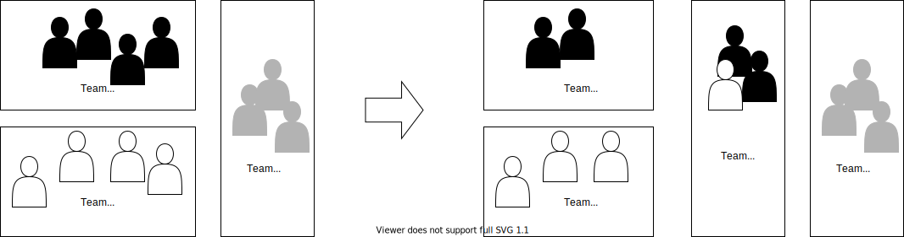

*Alternative to [Form Second Team out of Partly Layer-Team and First-Team Members](form-second-team-out-of-partly-layer-team-and-first-team-members)*

## Motivation

After applying [Form Cross-Functional Team out of Layer-Team Members](form-cross-functional-team-out-of-layer-team-members), a first cross-functional team has been ramped up. To form the next teams, basically two different approaches can be taken: Either we will take someone out of the first new team to be part of the second new team, or we leave the first team as it is and fill the new team with layer team members.

Forming follow-up cross-functional teams out of layer teams only has the following advantages: The existing cross-functional teams can work on in an undisturbed way.
Several new cross-functional teams can be formed at once.

The disadvantage is that every new team has to learn everything about the team change from scratch, since the team members that have already experienced a team reorganization stay in their team.

## Mechanics

- Follow the mechanics from [Form Cross-Functional Team out of Layer-Team Members](form-cross-functional-team-out-of-layer-team-members).

## Example(s)
