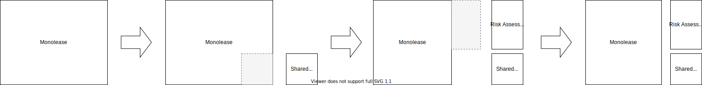

*Alternative/prerequisite to [Extract Bounded Context](XXXXXX) or [Implement Bounded Context from Scratch](XXX)*

{: .align-center}

## Motivation

As the result of the analysis of a monolithic piece of software one or several bounded context for extraction have been identified. Parts of the model are so common that they should not be duplicated. Thus, the common parts shall be put into their own artifact, while the rest of the contexts should be clearly separated.

## Mechanics

- Identify the elements that shall be members of the shared kernel.
- Create a new package/module for the shared kernel.
- Move the elements to the new package/module with refactoring XXXX.
- After finishing the extraction of the shared kernel, proceed with [Extract Bounded Context](XXXXXX).

## Example(s)

## Acknowledgement

I thank Mufrid Krilic for the idea for this refactoring.
