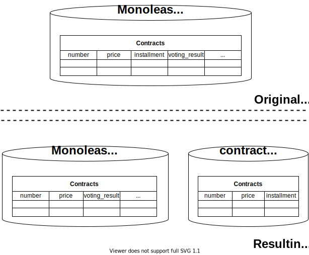

Type: Database refactoring

*A special case of [Split Table](https://databaserefactoring.com/SplitTable.html)*

{: .align-center}

## Motivation

As one step of [Carve Out Bounded Context (out of Monolith)](../strategic/carve-bounded-context-out-of-monolith) you’ve found a monolithic data model. (Often used to store a monolithic domain model.) In this data model you have identified a table that has become too big. The decision has been made to separate the parts for the newly extracted bounded context.

## Mechanics

- Create an empty new table in the database scheme of the carved-out context
- *** REfe***
- Copy to-be-moved columns from old to new table => [Move Column](https://databaserefactoring.com/MoveColumn.html)
- Copy to-be-moved triggers
- ...

## Example(s)
