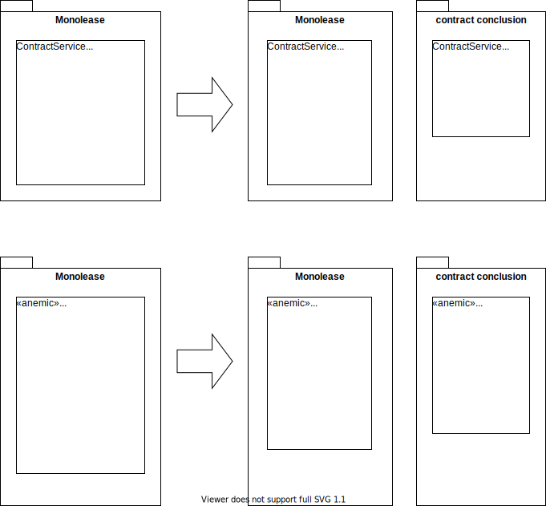

*A special case of [Extract Class](https://refactoring.com/catalog/extractClass.html)*

{: .align-center}

## Motivation

As one step of [Carve Out Bounded Context (out of Monolith)](../strategic/carve-bounded-context-out-of-monolith) you’ve found a monolithic anemic domain model. In this you have identified an anemic entity (a “data bag”) that has become too big. The decision has been made to split it.

This is often a follow up to [Carve Specialized Service Out of Monolithic Service](tactical-for-strategic/carve-specialized-service-out-of-monolithic-service) and accompanied by [Carve Specialized Data Model Out of Monolithic Table](tactical-for-strategic/extract-specialized-table).

## Mechanics

- Create empty new class in carved-out context
- Add instance field of type new class to the old class
- Copy to-be-moved fields from old to new class => [Move Field](https://refactoring.com/catalog/moveField.html)
- Copy first to-be-moved method to new class => [Move Method](https://refactoring.com/catalog/moveFunction.html)
- Replace method body in old class with a forward to method in new class
- Step by step replace calls to the method in the old class with calls to the method in the new class
- Delete the implementation in the old class
- Delete now unused fields in old class
- Repeat with other to-be-moved methods
- Remove instance field of type new class in the old class

## Example(s)
