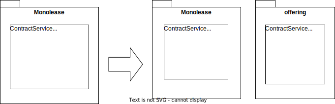

*Also known as: Carve Specialized Anemic Service Out of Monolithic Service*

*A special case of [Extract Class](https://refactoring.com/catalog/extractClass.html)*

{: .align-center}

## Motivation

As one step of [Extract Bounded Context](../strategic/extract-bounded-context) you’ve found a domain service that has become too big. The decision has been made to split it.

## Mechanics

- Create empty new class in carved-out context
- Add instance field of type new class to the old class
- Copy first to-be-moved method to new class => [Move Method](https://refactoring.com/catalog/moveFunction.html)
- Replace method body in old class with a forward to method in new class
- Step by step replace calls to the method in the old class with calls to the method in the new class
- Delete the implementation in the old class
- Repeat with other to-be-moved methods
- Remove instance field of type new class in the old class

## Example(s)
