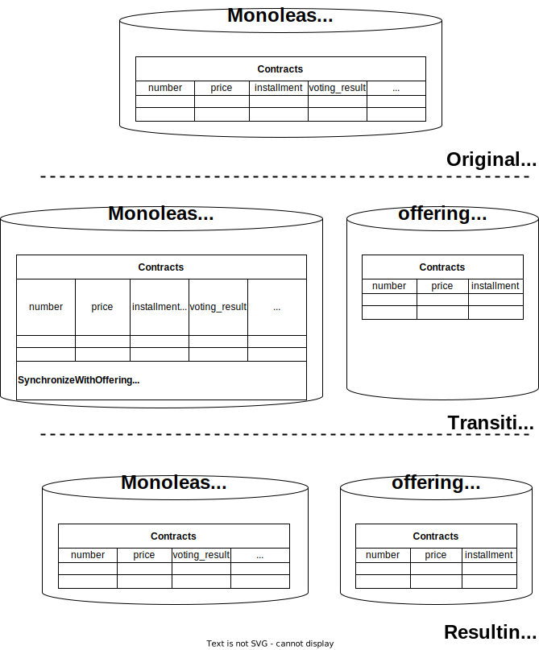

Type: Database refactoring

*A special case of [Split Table](https://databaserefactoring.com/SplitTable.html)*

{: .align-center}

## Motivation

As one step of [Extract Bounded Context](../strategic/extract-bounded-context) you’ve found a monolithic data model. (Often used to store a monolithic domain model.) In this data model you have identified a table that has become too big. The decision has been made to separate the parts for the newly extracted bounded context.

## Schema Update Mechanics

- Create an empty new table in the database scheme of the carved-out context.
- Copy to-be-duplicated columns from old to new table.
- Copy to-be-moved columns from old to new table by repeatedly applying [Move Column](https://databaserefactoring.com/MoveColumn.html).
- Introduce synchronizing triggers on both the monolithic and the carved-out table. They must be invoked by any change to the data in the tables. Beware of the triggers triggering each other.
- Add a drop date to the triggers.

## Data-Migration Mechanics

- Copy the data from the duplicated columns to the new table. Potentially not all rows existing in the monolith should also be present in the carved-out bounded context.
- Copy the data from the moved columns to the new table with [Move Data](https://databaserefactoring.com/MoveData.html).

## Access Program Mechanics

- Analyze the accessing program code thoroughly and update it accordingly during the transition period.
- If applicable extract a specialized repository for the carved-out bounded context.

## Example(s)
