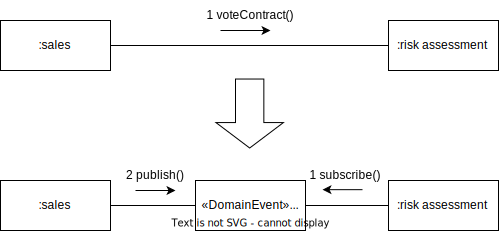

{: .align-center}

## Motivation

A method call causes relatively strong coupling. The calling object has to know the called object. Also, the communication is synchronous. When an domain event is used, the caller doesn't have to know the called object anymore. Instead both sides know the event only.

From giving an order to another object to informing the other object.

## Mechanics

- Create a new class for the domain event. Think about the name; since we’re changing the direction, it will usually be quite different from the name of the replaced method.
- Add a field to the domain event for every parameter of the to-be-replaced method. (There’s a similarity to [Introduce Parameter Object](https://refactoring.com/catalog/introduceParameterObject.html) here.)
- Subscribe the called class to the domain event. The subscribed event listener should call the method whose call is to be replaced.
- In the caller replace the call to the method with a publishing of the event.

## Example(s)
