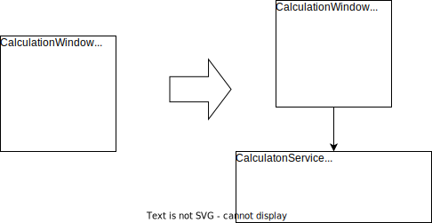

*Special Case of [Separate Domain from Presentation](XXXXXX)*

{: .align-center}

## Motivation

Smart UI is a pattern (in DDD considered an “anti-pattern,” see [Evans2004, p. 76]) that mixes up UI code and business logic. This refactoring helps to separate the two concerns.

## Mechanics

- In the smart UI class separate the business logic from the UI logic with [Extract Method](https://refactoring.com/catalog/extractMethod.html).
- Examine the extracted business logic method. Can it work only on parameters without using fields from the class? Then this refactoring is right, otherwise [*Extract Entity from Smart UI*](extract-entity-from-smart-ui) might fit better.
- Apply [Extract Class](https://refactoring.com/catalog/extractClass.html) and move the business logic method into the newly created service.

## Example(s)
