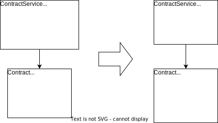

*A special case of [Move Method](https://refactoring.com/catalog/moveFunction.html)*

{: .align-center}

## Motivation

A domain service is a class that contains pure domain logic. This domain logic often operates on entities. If a piece of domain logic operates only on one entity and forces that entity to expose its data, it might make sense to move it down into the entity. Thus, the cohesion of the entity can be increased and the data can be encapsulated in the entity.

This is one of the small refactorings to [Heal Entity Anemia](heal-entity-anemia).

## Mechanics

- Copy the method from entity to service.
- Change the implementation of the to-be-moved-down method in the service so that it just forwards to the method in the entity.
- Identify code that is calling the method and check if it makes sense that they directly work on the entity. If yes change them to call the method on the entity directly.
- If no more code is calling the method in the service delete it.
- Check if you can now get rid of setters by encapsulating data with [Replace Setter](replace-setter) or [Remove Setter](remove-setter).

## Example(s)
