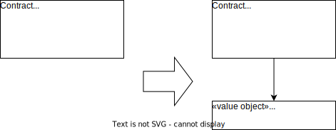

*A special case of [Replace Primitive with Object](https://refactoring.com/catalog/replacePrimitiveWithObject.html)*

{: .align-center}

## Motivation

Many systems excessively use primitive types to express value-like domain concepts. All over the place you will find naked `int`s and `String`s. (Martin Fowler calls this bad smell Primitive Obsession.) A better way is to define types in their own right for these domain concepts and thus both make the code more expressive and less error-prone.

## Mechanics

- Create a simple value object class.
- Make sure the class is both identity-less and immutable.
- Stepwise use the new value class where sofar a primitive type was used.
- Where applicable, move domain logic (typical cases are validation and arithmetic) into the value class with [Extract Method](https://refactoring.com/catalog/extractFunction.html), [Move Method](https://refactoring.com/catalog/moveFunction.html), and the like.

## Example(s)
