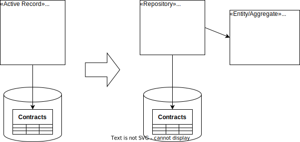

{: .align-center}

## Motivation

An *active record* is a part of a domain model that does two things: (a) it represents a concept from the domain and (b) it manages the storage of that concept. This refactoring separates these two responsibilities from each other.

## Mechanics

- Identify methods in active records as either domain logic or data access logic. If they are mixed use [*Extract Method*](https://refactoring.com/catalog/extractMethod.html) first.
- Create repository class and copy all data access logic into it.
- Mark all data access methods in active record as `@Deprecated` or `[Obsolete]`or the like.
- Replace every call to a data access method of the active record with a a call to the corresponding method in the repository.
- Remove data access methods from active record thus turning it into an aggregate/entity.

Often, a follow-up step to this refactoring is to [split the repository into interface and implementation](split-repository-into-interface-and-implementation).

## Example(s)
