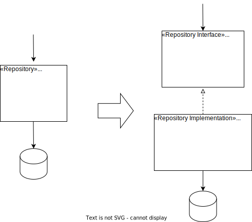

{: .align-center}

## Motivation

A *repository* is a place in your domain layer where you can keep your entities/aggregates when you don’t need them. A typical implementation for repository is to store the aggregate’s data into a database. Database access is a technical detail that the domain layer should have no knowledge of. Thus, separate the definition of the repository (domain layer) from its implementation (infrastructure layer).

<!--
Apply DIP; Separate Port from Adapter; separate Infrastructure Code from Domain Layer.
-->

## Mechanics

- Apply [*Extract Interface*](https://refactoring.com/catalog/extractInterface.html) on the repository.
- Move the implementation to the infrastructure layer; keep the interface in the domain layer.
- Move all uses of the old repository to the new interface. Only the configuration of the dependency injection is allowed to know the repository implementation.

## Example(s)
